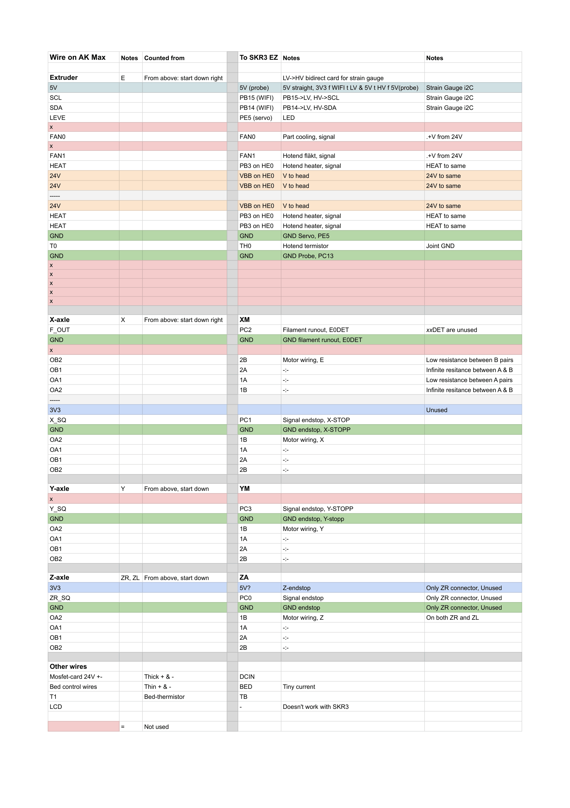

# Wiring of the Kobra Max connections to the BTT SKR3 EZ board
>[!WARNING]
>This is not a universal Kobra Max pinout.  
>Anycubic used multiple board and harness revisions. Verify every connector, motor coil pair, supply voltage and polarity on your own machine before applying power.  
>Never connect or disconnect stepper motors while the printer is powered.

## Wiring diagram

The spreadsheet diagram is useful for seeing the original connector grouping and the physical order of the wires:
<p>
  <details>
    <summary><h3>Spreadsheet diagram</h3></summary>
    <picture>
          
    </picture>
  
</details></p>

The tables below are the text-based reference for the currently verified wiring. If the spreadsheet and this document disagree, treat the text tables as the newer source and verify the physical wire before changing anything.


## Important to note
> [!NOTE]
> ### Original wire labels  
> Names such as `OA1`, `OA2`, `OB1`, `OB2`, `X_SQ`, `SCL`, `SDA` and `LEVE` are the labels printed on the original Anycubic board.  
> These names identify the original connector pins and ***do not*** always describe the final function accurately.  
> Example:  
>> Original `SCL` is used as the **LeviQ probe output**   
>> Original `SDA` is used as the **LeviQ reset input**   
>> Original `LEVE` controls the toolhead LED
> The `SCL` and `SDA` labels are therefore not used as an *I²C* bus in this Klipper configuration.

> ### Stepper coil naming  
> On the original Anycubic board:
> - `OA1` and `OA2` are one motor coil
> - `OB1` and `OB2` are the other motor coil
> 
> On the SKR 3 EZ motor headers:
> - `1A` and `1B` are one motor coil
> - `2A` and `2B` are the other motor coil  
>   
> The base mapping used in this build is:
> 
> | Anycubic motor wire | SKR 3 EZ motor pin |
> |---|---|
> | `OA1` | `1A` |
> | `OA2` | `1B` |
> | `OB1` | `2A` |
> | `OB2` | `2B` |
>
> Swapping the two wires of one coil reverses that motor. Swapping both coil pairs does not reverse it.

> ### Grounds  
>   
> Logic grounds on the SKR are electrically common, but the wiring was kept grouped by function where possible:  
>  
> - Thermistor ground near the thermistor input  
> - Probe and level-shifter ground near the probe/servo headers  
> - Endstop grounds near their endstop inputs
> 
> #### Note:
> >The separate chassis-bonding wire on the X gantry is protective/chassis grounding and is not a replacement for a signal ground.
---

# Verification legend

- ✅ Verified on this machine
- ⚠️ Machine-specific or requires measurement
- 🧪 Mapped but not yet fully tested in Klipper
- ❌ Not used

<p><details>
  <summary><h2>SKR 3 EZ quick reference</h2></summary>

  This table shows the SKR pins used by the current configuration.

| Function | SKR connection | MCU pin | Status |
|---|---|---:|---|
| X stepper output | `XM` | Step `PD4`, Dir `PD3`, Enable `PD6` | ✅ |
| X TMC2209 UART | X driver | `PD5` | ✅ |
| Y stepper output | `YM` | Step `PA15`, Dir `PA8`, Enable `PD1` | ✅ |
| Y TMC2209 UART | Y driver | `PD0` | ✅ |
| Z stepper outputs | `ZAM` and `ZBM` | Step `PE2`, Dir `PE3`, Enable `PE0` | ✅ |
| Z TMC2209 UART | Z driver | `PE1` | ✅ |
| Extruder stepper output | `E0M` | Step `PD15`, Dir `PD14`, Enable `PC7` | ✅ |
| Extruder TMC2209 UART | E0 driver | `PC6` | ✅ |
| X endstop | `X-STOP` | `PC1` | ✅ |
| Y endstop | `Y-STOP` | `PC3` | ✅ |
| Filament runout | `E0-DET` | `PC2` | 🧪 |
| Hotend heater | `HE0` | `PB3` | ✅ |
| Hotend thermistor | `TH0` | `PA2` | ✅ |
| Bed MOSFET control | `HB` | `PD7` | ✅ |
| Bed thermistor | `TB` | `PA1` | ✅ |
| Part-cooling fan | `FAN0` | `PB7` | ✅ |
| Hotend fan | `FAN1` | `PB6` | ✅ |
| LeviQ probe output | WiFi header GPIO through level shifter | `PB15` | ✅ |
| LeviQ reset | WiFi header GPIO through level shifter | `PB14` | ✅ |
| Toolhead LED | Servo GPIO | `PE5` | ✅ |

</details></p>

# Toolhead / original E connector

The original E connector carries almost the complete toolhead harness:

- LeviQ power, probe output and reset
- Toolhead LED control
- Part-cooling fan
- Hotend fan
- Hotend heater
- Hotend thermistor
- Multiple parallel 24 V and HEAT conductors

<p><details>
  <summary><h2>Toolhead signal mapping</h2></summary>

| Original label | Verified function | SKR 3 EZ connection | Level | Status | Verification |
|---|---|---|---|---|---|
| `5V` | LeviQ/toolhead logic supply | `+5V` from probe/servo header | 5 V | ✅ | Probe board powered and functional |
| `SCL` | LeviQ probe output | `PB15` through level shifter | 5 V → 3.3 V | ✅ | `QUERY_PROBE`, Z homing and probing |
| `SDA` | LeviQ reset input | `PB14` through level shifter | 3.3 V → 5 V | ✅ | LOW/HIGH pulse resets load cell |
| `LEVE` | Toolhead LED control | `PE5` | 3.3 V output | ✅ | `SET_PIN`, HIGH = on |
| `GND` | LeviQ/LED ground | Probe/servo `GND` | 0 V | ✅ | Common ground |
| `FAN0` | Part-cooling fan switched return | `FAN0`, `PB7` | Switched low side | ✅ | `M106` / `M107` |
| `FAN1` | Hotend fan switched return | `FAN1`, `PB6` | Switched low side | ✅ | Automatic heater fan |
| `T0` | Hotend thermistor signal | `TH0`, `PA2` | Analog | ✅ | Correct temperature reading |
| Thermistor `GND` | Hotend thermistor return | `TH0 GND` | 0 V | ✅ | Correct temperature reading |

</details></p>

## Hotend power conductors

The toolhead harness contains three parallel `24V` conductors and three parallel `HEAT` conductors.
Continuity testing confirmed that each group is joined on the toolhead PCB.
| Original group | SKR connection | Function | Status |
|---|---|---|---|
| All three `24V` wires | `HE0 +` | Constant +24 V to toolhead/heater | ✅ |
| All three `HEAT` wires | `HE0 -`, switched by `PB3` | Hotend heater switched return | ✅ |
#### Note:
>> The parallel conductors should remain grouped so the heater current is shared across the original connector pins.
>> Do not force several conductors into a terminal in a way that leaves loose strands.

## Fan supply
The original toolhead PCB distributes the common +24 V supply to the two fans.  
The `FAN0` and `FAN1` wires in the harness are their separate switched returns. The SKR fan outputs use low-side switching.

---

# LeviQ strain-gauge probe

The original LeviQ strain-gauge probe is retained.

## Logic level shifter

A bidirectional 3.3 V ↔ 5 V logic level shifter is used between the original toolhead and the SKR GPIO pins.
<p><details>
  <summary><h4>Level-shifter mapping</h4></summary>
  
| Level-shifter connection | Connected to |
|---|---|
| `HV` reference | Toolhead/probe `5V` |
| `LV` reference | SKR `3.3V` |
| Common `GND` | SKR ground and toolhead ground |
| HV channel for probe | Original `SCL` |
| LV channel for probe | `PB15` |
| HV channel for reset | Original `SDA` |
| LV channel for reset | `PB14` |

</details></p>

> [!CAUTION]
> Do not connect the original probe output directly to an SKR GPIO.  
>
> The original toolhead can output 5 V. The STM32 GPIO uses 3.3 V logic.

<p><details>
  <summary><h2>Verified signal behavior</h2></summary>
  
  ### Probe output

  - Idle state: *HIGH*
  - Triggered by nozzle/load-cell force: *LOW*
  - Klipper pin: `^!PB15`
  - Used as `probe:z_virtual_endstop`

  ### Reset
  The LeviQ zero point is reset by pulsing the reset signal:

  ```gcode
  SET_PIN PIN=leviq_reset VALUE=0
  G4 P100
  SET_PIN PIN=leviq_reset VALUE=1
  G4 P600
  ```
  This reset is run in the probe `activate_gcode` before every probe attempt.
  Without the reset, the measured trigger point drifted significantly between samples. With the reset enabled, repeated measurements became consistent enough for Z homing and bed meshing.

  ### Toolhead LED
  The original `LEVE` wire is connected to `PE5`.
  > - `1` = LED on  
  > - `0` = LED off
  The current configuration turns the LED on after Klipper starts.

</details></p>

---

# X harness

The original X harness carries more than the X-axis motor.

It contains:

- X motor
- Bowden extruder motor
- X endstop
- Filament runout sensor
- A separate chassis-ground wire to the X gantry
- One unused 3.3 V position

<p><details>
  <summary><h2>X harness signals</h2></summary>

| Original label/group | Function | SKR connection | Status | Verification |
|---|---|---|---|---|
| `X_SQ` | X endstop signal | `X-STOP`, `PC1` | ✅ | `QUERY_ENDSTOPS`, X homing |
| Endstop `GND` | X endstop ground | `X-STOP GND` | ✅ | `QUERY_ENDSTOPS`, X homing |
| `F_OUT` | Filament runout signal | `E0-DET`, `PC2` | 🧪 | Mapped, not enabled in current config |
| F_OUT `GND` | Filament runout ground | `E0-DET GND` | 🧪 | Mapped, not enabled in current config |
| `3V3` | Unused on this machine | Not connected | ❌ | No wire used |
| Separate earth wire | X-gantry chassis bonding | Retain original chassis connection | ✅ | Physical inspection |

</details></p>

<p><details>
  <summary><h2>X harness motors</h2></summary>
  
### Extruder motor inside X harness
The first motor group in the X harness belongs to the Bowden extruder motor.Connect this group to `E0M`.

| Original wire | E0 motor pin |
|---|---|
| `OA1` | `1A` |
| `OA2` | `1B` |
| `OB1` | `2A` |
| `OB2` | `2B` |


### X motor inside X harness
The second motor group belongs to the X-axis motor. Connect this group to `XM`.

| Original wire | X motor pin |
|---|---|
| `OA1` | `1A` |
| `OA2` | `1B` |
| `OB1` | `2A` |
| `OB2` | `2B` |

</details></p>

---

# Y harness

The Y harness contains one Y motor and a two-wire Y endstop.

The original `3V3` position is not populated on this machine.

<p><details>
  <summary><h2>Y harness signals</h2></summary>

  | Original label | Function | SKR connection | Status | Verification |
|---|---|---|---|---|
| `Y_SQ` | Y endstop signal | `Y-STOP`, `PC3` | ✅ | `QUERY_ENDSTOPS`, Y homing |
| `GND` | Y endstop ground | `Y-STOP GND` | ✅ | `QUERY_ENDSTOPS`, Y homing |
| `OA1` | Y motor coil 1 | `1A` | ✅ | `STEPPER_BUZZ` |
| `OA2` | Y motor coil 1 | `1B` | ✅ | `STEPPER_BUZZ` |
| `OB1` | Y motor coil 2 | `2A` | ✅ | `STEPPER_BUZZ` |
| `OB2` | Y motor coil 2 | `2B` | ✅ | `STEPPER_BUZZ` |
</details></p>

---

# Z harness

The original machine uses two Z motors.

Both motors are:
> - Driven in parallel  
> - Mechanically synchronized by the belt across the top of the frame  
> - Controlled by one TMC2209 Z driver on the SKR 3 EZ  
The SKR provides two parallel outputs from the same Z driver:  
> - `ZAM`  
> - `ZBM`

## Original connector arrangement
On this machine:
> - Two original `ZR` motor connectors are populated  
> - The original `ZL` connector is not populated  
> - One ZR harness also carries the original optical Z sensor  
> - The optical Z sensor is not used by the current Klipper configuration

<p><details>
  <summary><h2>Z motor mapping</h2></summary>

Apply the same coil mapping to each motor connector:  

| Original wire | SKR Z motor pin |  
|---|---|  
| `OA1` | `1A` |  
| `OA2` | `1B` |  
| `OB1` | `2A` |  
| `OB2` | `2B` |  
Connect one motor to `ZAM` and the other to `ZBM`.
</details></p>

> [!IMPORTANT]
> Test each Z motor individually before connecting both.  
> Because the motors are mirrored and mechanically linked, one connector may need one coil pair reversed so both motors rotate in the same mechanical direction.  
> If both motors work separately but fight each other when connected together, swap `1A` and `1B` on one motor connector, or swap `2A` and `2B` on that connector. Do not change both pairs.  
> If that happens, watch out for a skewed gantry because they have probably skipped teeth on the connecting belt.

<p><details>
  <summary><h2>Original optical Z sensor</h2></summary>

| Original label | Function | Current connection | Status |
|---|---|---|---|  
| `3V3` | Optical sensor supply | Not connected | ❌ |  
| `ZR_SQ` | Optical Z sensor signal | Not connected | ❌ |  
| `GND` | Optical sensor ground | Not connected | ❌ |

Klipper uses the LeviQ probe as:
```ini
endstop_pin: probe:z_virtual_endstop
```  
The original optical Z sensor is therefore unnecessary in the current build.

</details></p>

---

# Heated bed and external MOSFET

The original external bed MOSFET board is retained.  
This keeps the high-current bed load off the SKR heater MOSFET and terminal.

<p><details>
  <summary><h2>PSU and SKR power</h2></summary>

| Original wiring | SKR connection | Status |
|---|---|---|
| 24 V PSU positive | `DCIN +` | ✅ |
| 24 V PSU negative | `DCIN -` | ✅ |

> [!TIP]
> You can disconnect the connector from the MOSFET board, put the wires into the SKR, and then reconnect the connector.  
> This is only possible with my [revised adapter board](./stl/Kobra%20Max%20SKR3%20Adapter%20plate.stl) according to my tests.  
</details></p>

<p><details>
  <summary><h2>Bed MOSFET control & bed thermistor</h2></summary>

  ### Bed MOSFET control  
The original thin bed-control pair is connected to the SKR `HB` output.

| SKR HB terminal | External MOSFET connection | Status |
|---|---|---|
| `HB +` | MOSFET control positive | ✅ |
| `HB -` | MOSFET control negative/switched return | ✅ |

The high-current bed wires remain connected to the original external MOSFET board.

  ### Bed thermistor
| Original connection | Function | SKR connection | MCU pin | Status |
|---|---|---|---:|---|
| `T1` | Bed thermistor | `TB` | `PA1` | ✅ |
</details></p>

---

<p><details>
  <summary><h2>Fans</h2></summary>

| Original function | SKR output | MCU pin | Klipper section | Status |
|---|---|---:|---|---|
| Part-cooling fan | `FAN0` | `PB7` | `[fan]` | ✅ |
| Hotend fan | `FAN1` | `PB6` | `[heater_fan hotend_fan]` | ✅ |
| Mainboard/electronics fan | Not documented here yet | — | — | ⚠️ |
The hotend fan is configured to start automatically when the extruder exceeds the configured threshold.
</details></p>

---

<p><details>
  <summary><h2>Unused original connectors</h2></summary>

| Original connection | Current status | Notes |
|---|---|---|
| Original LCD | ❌ Not used | The stock display is not directly supported by this build |
| `SP1` | ❌ Not used | No harness was connected on this machine |
| Original Z optical sensor | ❌ Not used | LeviQ is the Z virtual endstop |
| X/Y `3V3` endstop supply positions | ❌ Not used | X and Y endstops are two-wire devices |
| Original `ZL` header | ❌ Not populated | Both motors were connected through the ZR arrangement |
| Filament runout | 🧪 Pending | Wiring is mapped to `PC2`, but current config does not enable it |

</details></p>

---
---

<p><details>
  <summary><h1>Re-crimping and connector work</h1></summary>

The original Anycubic connectors do not plug directly into every required SKR header.
The wires were moved into new connector housings supplied with the SKR board, and some terminals were re-crimped.

## Recommendations

- Label every wire before removing it from the original housing
- Move a single, or very few wires at a time
- Photograph every connector before depinning it
- A proper JST crimper tool probably helps, I used round-nose pliers
- Pull-test each crimp gently
- Verify each motor coil pair with a multimeter
- Do not rely on wire colour; the original harness uses only black wires

A (older version) of [this](https://niimbots.com/products/d110-portable-wireless-connect-rechargeable-mini-label-printer-with-tape?variant=43704982470892)<sup> *(NIIMBOT D110)* </sup> was used during this build because the harness becomes basically impossible to identify once multiple wires have been removed from their housing.

### Stepper motors
With the motor disconnected from the SKR:
- `1A` ↔ `1B` should show low resistance  
- `2A` ↔ `2B` should show low resistance  
- Any connection between coil 1 and coil 2 should be open

</details></p>

<p><details>
  <summary><h1>Functional verification</h1></summary>

  The following tests were used after wiring. (*in roughly this order*)

| Function | Test |
|---|---|
| MCU connection | `ls -l /dev/serial/by-id/...` |
| TMC UART | `DUMP_TMC STEPPER=stepper_x` and equivalent |
| Stepper wiring | `STEPPER_BUZZ STEPPER=stepper_x` and equivalent |
| X/Y endstops | `QUERY_ENDSTOPS`, trigger manually, `QUERY_ENDSTOPS` again |
| LeviQ probe | `QUERY_PROBE`, trigger manually, `QUERY_PROBE` again|
| Z homing | `G28 Z` after manual trigger safety test |
|---|---|
| LeviQ repeatability | `PROBE_ACCURACY SAMPLES=10` at different points |
| Toolhead LED | `SET_PIN PIN=nozzle_led VALUE=1` |
| Part-cooling fan | `M106 S255`, then `M107` |
| Hotend fan | Heat extruder above configured threshold |
| Hotend thermistor | Verify plausible room temperature |
| Hotend heater | Low-temperature test before PID calibration |
| Bed thermistor | Verify plausible room temperature on `TB` |
| Bed MOSFET | Low-temperature bed test before PID calibration |

</details></p>

<p><details>
  <summary><h1>Known wiring mistakes encountered during this build
</h1></summary>

These errors are documented because they produced symptoms that could easily be mistaken for bad firmware or defective hardware.

> ## Mixed stepper coil pairs  
> Mixing one `OA` wire with one `OB` wire on the same SKR coil pair caused TMC shutdowns and non-moving motors.  
> *Keep both original coil pairs intact.*

> ## Extruder connected to E0 but configured as E1
> The correct E0 pins are:
> ```text
> Step:   PD15
> Dir:    PD14
> Enable: PC7
> UART:   PC6
> ```
> Using the E1 UART pin caused:
> ```text
> Unable to read tmc uart 'extruder' register IFCNT
> ```

> ## Z motors fighting each other
> Both Z motors worked individually but fought each other when connected together.
> One motor connector required one coil pair to be reversed so both motors moved in the same mechanical direction.

> ## Bed thermistor connected to TH1
> The current configuration uses:
> ```text
> TB / PA1
> ```
> Connecting the bed thermistor to `TH1` produced an invalid temperature reading.

> ## LeviQ without reset
> The probe output worked, but repeated measurements drifted severely until the reset line was identified and pulsed before each probe attempt.

</details></p>

--- 

# Related configuration files

The verified wiring is represented in:

- [`printer.cfg`](./config/printer.cfg)
- [`steppers.cfg`](./config/steppers.cfg)
- [`tmc.cfg`](./config/tmc.cfg)
- [`fans.cfg`](./config/fans.cfg)
- [`bed.cfg`](./config/bed.cfg)
- [`leviq_probe.cfg`](./config/leviq_probe.cfg)
- [`accessories.cfg`](./config/accessories.cfg)
- [`macros.cfg`](./config/macros.cfg)

Calibration values such as PID constants, `z_offset`, motor current, pressure advance, movement limits and mesh limits are machine-specific even when the wiring is identical.

# References

Additional board diagrams, source projects and documentation are listed in [`Useful_links.md`](../Useful_links.md).

# Disclaimer

> [!IMPORTANT]
> I tried to be as thorough as possible, but I have probably made mistakes. Everything is done at your own risk.
> If I have missed something, or you wonder something that isn't in this repository, reach out and I can see if I can help

> [!Note]
> Since English isn't my first language, I have used an LLM to summarize, translate and structurize a lot of my findings. 
